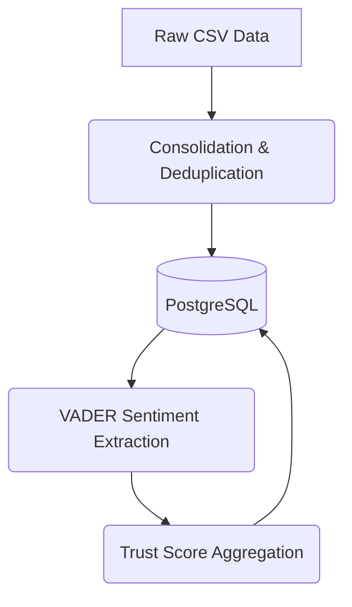
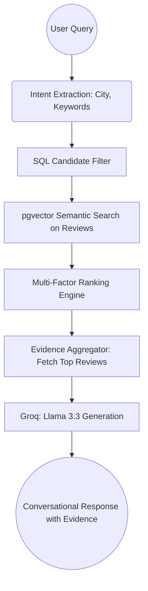

# TripOn 2.0: Technical Deep-Dive & Architecture Manual

## 1. Project Overview
TripOn 2.0 is an intelligent, evidence-first hotel recommendation system for the Indian market. Unlike traditional search engines that rely solely on star ratings, TripOn 2.0 uses **Retrieval-Augmented Generation (RAG)** to "read" thousands of guest reviews and provide conversational recommendations backed by specific, verifiable evidence.

---

## 2. Phase 1: Data Engineering & Foundation

### A. Data Collection & Consolidation
The project started by merging two large-scale datasets:
- `master_hotel_data.csv`: Global hotel data (~45MB).
- `master_indian_hotel_data.csv`: Detailed Indian hotel feedback (~72MB).

**Implementation:**
- **File:** `scripts/ingestion/consolidate_data.py`
- **Logic:** Maps different CSV headers to a unified schema, normalizes ratings to a 5-point scale, and deduplicates records.
- **Geographic Expansion:** `scripts/ingestion/generate_synthetic_states.py` was used to ensure all 36 Indian States/UTs had a minimum representation of 5 hotels each.

### B. Relational Migration
Data was moved from flat CSVs to a highly-available **PostgreSQL (Supabase)** database to support complex relational queries and vector operations.

- **File:** `scripts/ingestion/migrate_to_postgres.py`
- **Schema:** 
    - `locations`: Cities and States.
    - `hotels`: Metadata, average ratings, and trust scores.
    - `reviews`: Individual text feedback with foreign keys to hotels.

---

## 3. Phase 2: The Intelligence Layer (Scoring & NLP)

### A. Aspect-Based Sentiment Analysis (ABSA)
We use NLP to quantify "how good" a hotel is across 7 specific categories (Cleanliness, Service, Food, Wifi, Location, Noise, Safety).

- **File:** `scripts/scoring/extract_aspects.py`
- **Library:** `vaderSentiment`.
- **Logic:** Breaks reviews into sentences, identifies keywords (e.g., "wifi", "noisy"), and calculates sentiment polarity for each category.

### B. The Trust Score Engine
- **File:** `scripts/scoring/aggregate_scores.py`
- **Logic:** Uses SQL Common Table Expressions (CTEs) to calculate hotel-level averages of all review sentiment scores.
- **Trust Score Formula:** Combines raw user ratings with the processed NLP sentiment to create a "Trust Metric" (0-10).

---

## 4. Phase 3: Evidence-First RAG Pipeline

### A. Semantic Vectorization (Embeddings)
To allow "meaning-based" search, we convert text into numerical vectors.

- **Transformer Model:** `all-MiniLM-L6-v2` (via `sentence-transformers`).
- **Vector Storage:** `pgvector` extension in PostgreSQL.
- **Granularity:** We embed **individual reviews** rather than just hotel descriptions to capture specific details (e.g., "fast wifi for Skype").
- **Pipeline Scripts (`rag/pipeline/`):**
    - `generate_embeddings.py`: Processes the 81k+ reviews into 384-dimensional vectors.
    - `generate_summaries.py`: Creates structured text summaries of hotel performance.
    - `generate_summary_embeddings.py`: Vectorizes summaries for fast candidate filtering.

### B. Hybrid Retrieval & Chat Assistant
This is the "Brain" of the system.

- **LLM:** `llama-3.3-70b-versatile` (via **Groq API**).
- **Engine Modules (`rag/engine/`):**
    - `hybrid_retriever.py`: Combines hard SQL filters (e.g., "in Delhi") with semantic vector search.
    - `evidence_aggregator.py`: For the top 5 hotels, it finds the **3 most relevant reviews** to act as "evidence."
    - `chat_assistant.py`: Orchestrates the flow and prompts the LLM to answer **ONLY** using the provided evidence.

---

## 5. Directory & File Breakdown

### **`rag/` (Retrieval-Augmented Generation)**
- **`engine/`**:
    - `chat_assistant.py`: Entry point. Connects to Groq, manages the conversation.
    - `hybrid_retriever.py`: Multi-factor ranker (Weights: 40% Semantic, 20% Trust, 20% Aspect, 10% Rating, 10% Recency).
    - `evidence_aggregator.py`: Packages hotel data + reviews + drawbacks into a JSON "Evidence Packet."
- **`pipeline/`**:
    - `generate_embeddings.py`: Batch-processes review text into the vector database.

### **`scripts/` (Operations)**
- **`cleaning/`**:
    - `clean_reviews.py`: Heuristic filter that removed ~66k non-hotel (restaurant) reviews.
    - `refine_reviews.py`: Removes duplicates, Excel errors, and short low-value text.
- **`ingestion/`**: Data loading and normalization scripts.
- **`scoring/`**: NLP analysis and trust-score calculation.

### **`tests/` & `logs/`**
- **`tests/`**: Contains validation scripts to verify retrieval quality and LLM grounding.
- **`logs/`**:
    - `embedding_metrics.csv`: Performance logs for vector generation (Speed, Memory, Batch info).
    - `chat_validation_log.txt`: History of query tests and LLM responses.

---

## 6. Project Flowcharts

### **A. Data Ingestion & Scoring Flow**

### **B. RAG Retrieval Flow (The "Request" Loop)**

---

## 7. Technical Stack Summary
- **Languages:** Python 3.12, SQL.
- **Database:** PostgreSQL + `pgvector` (Supabase).
- **ML Models:** `all-MiniLM-L6-v2` (Embeddings), `Llama 3.3-70b` (Reasoning).
- **Libraries:**
    - `psycopg2`: Database connection.
    - `sentence-transformers`: Vector generation.
    - `vaderSentiment`: Sentiment analysis.
    - `groq`: LLM API orchestration.
    - `python-dotenv`: Secure credential management.
