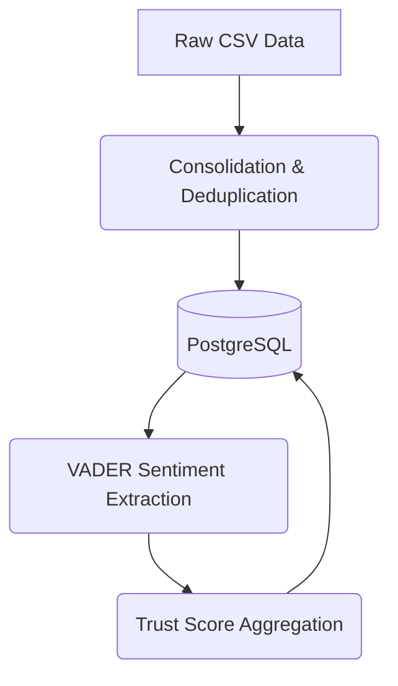
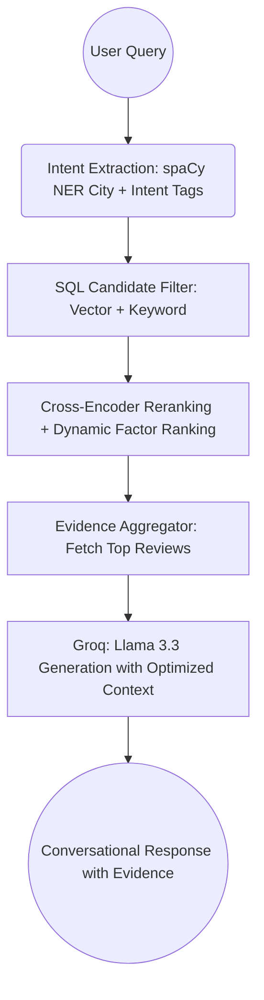

# TripOn 2.0: Technical Deep-Dive & Architecture Manual

## 1. Project Overview
TripOn 2.0 is an intelligent, evidence-first hotel recommendation system for the Indian market. Unlike traditional search engines that rely solely on star ratings, TripOn 2.0 uses **Retrieval-Augmented Generation (RAG)** to "read" thousands of guest reviews and provide conversational recommendations backed by specific, verifiable evidence.

---

## 2. Phase 1: Data Engineering & Foundation

### A. Data Collection & Consolidation
The project utilizes a multi-stage ingestion pipeline to build a comprehensive Indian hotel database, overcoming raw data limitations:

1. **The Fusion Layer (`scripts/ingestion/merge_reviews_to_hotels.py`):**
   - **Source Fusing:** Combines property metadata from **Goibibo** with high-volume review text from **TripAdvisor**.
   - **Structural Mapping:** To solve the "unlabeled reviews" problem in the TripAdvisor set, reviews were mapped to Delhi-based Goibibo properties using randomized assignment. This provides the RAG pipeline with 148k+ real-world review samples attached to verified hotel profiles.
   - **Outcome:** A robust 148k-row master dataset (`master_indian_hotel_data.csv`).

2. **National Expansion (`scripts/ingestion/generate_synthetic_states.py`):**
   - **Geographic Coverage:** Guarantees that the system handles queries for all **36 Indian States and Union Territories**.
   - **Logic:** Generates 5 baseline hotels per state (excluding Delhi) with valid geographic coordinates and schema-compliant reviews.
   - **Outcome:** Ensures no search query for an Indian state returns an empty result set.

3. **Normalization:** `scripts/ingestion/consolidate_data.py` maps disparate CSV headers to a unified schema and normalizes ratings to a 10-point internal scale (stored as 5-point in the final DB).

### B. Relational Migration
Data was moved from flat CSVs to a highly-available **PostgreSQL (Supabase)** database to support complex relational queries and vector operations.

- **File:** `scripts/ingestion/migrate_to_postgres.py`
- **Schema:** 
    - `locations`: Cities and States.
    - `hotels`: Metadata, average ratings, and trust scores.
    - `reviews`: Individual text feedback with foreign keys to hotels.

---

## 3. Phase 2: The Intelligence Layer (Scoring & NLP)

### A. Aspect-Based Sentiment Analysis (ABSA)
We use NLP to quantify "how good" a hotel is across 7 specific categories (Cleanliness, Service, Food, Wifi, Location, Noise, Safety).

- **File:** `scripts/scoring/extract_aspects.py`
- **Library:** `vaderSentiment`.
- **Logic:** Breaks reviews into sentences, identifies keywords (e.g., "wifi", "noisy"), and calculates sentiment polarity for each category.

### B. The Trust Score Engine
- **File:** `scripts/scoring/aggregate_scores.py`
- **Logic:** Uses SQL Common Table Expressions (CTEs) to calculate hotel-level averages of all review sentiment scores.
- **Trust Score Formula:** Combines raw user ratings with the processed NLP sentiment to create a "Trust Metric" (0-10).

---

## 4. Phase 3: Evidence-First RAG Pipeline

### A. Semantic Vectorization (Embeddings)
To allow "meaning-based" search, we convert text into numerical vectors.

- **Transformer Model:** `all-MiniLM-L6-v2` (via `sentence-transformers`).
- **Vector Storage:** `pgvector` extension in PostgreSQL.
- **Granularity:** We embed **individual reviews** rather than just hotel descriptions to capture specific details (e.g., "fast wifi for Skype").
- **Pipeline Scripts (`rag/pipeline/`):**
    - `generate_embeddings.py`: Processes the 81k+ reviews into 384-dimensional vectors.
    - `generate_summaries.py`: Creates structured text summaries of hotel performance.
    - `generate_summary_embeddings.py`: Vectorizes summaries for fast candidate filtering.

### B. Hybrid Retrieval, Ranking, & Chat Assistant
This is the "Brain" of the system.

- **LLM:** `llama-3.3-70b-versatile` (via **Groq API**).
- **Engine Modules (`rag/engine/`):**
    - `chat_assistant.py`: Orchestrates the request, optimizes evidence packets for token efficiency, and manages chat history.
    - `hybrid_retriever.py`: 
        - Performs **NER-based city extraction** using spaCy.
        - Executes **Hybrid Retrieval** combining `pgvector` similarity and keyword (`ILIKE`) filtering.
        - Implements a **Dynamic Ranking Engine** that adjusts metric weights based on user intent.
    - `evidence_aggregator.py`: 
        - Packages hotel data and reviews into a token-optimized JSON "Evidence Packet" using secure parameterized SQL.
        - **Strict Sentiment Enforcement**: Eliminates false-positives by hard-filtering retrieved reviews at the SQL level, ensuring only positive experiences (rating >= 4) are aggregated.
        - **Intelligent Quote Extraction**: Uses a secondary LLM request to dynamically extract focused, 150-character positive snippets from the reviews for clean UI card display.
    - `models.py`: Singleton-based model access for efficient resource management.

---

## 5. Conversational Memory & Formatting

The orchestration flow incorporates PostgreSQL (`chat_history` table) to maintain seamless conversational memory across user sessions. 

- **Session Context Injection**: `ChatAssistant` looks up the last 5 conversation turns via `db_helper.get_recent_chat_history(chat_id)` and injects them into the Llama-3 prompt so follow-up queries implicitly understand the context.
- **LLM Title Generation**: For new sessions, a secondary Llama-3 request dynamically generates a concise (<50 char) "relevant tag" (title) from the first prompt. This tag is stored within the chat history and powers the UI sidebar navigation.
- **Strict Formatting Guardrails**: The final LLM response generation step is restricted by a strict system prompt. The model is explicitly barred from generating lists, bullet points, hotel names, or scoring metrics. Its sole responsibility is to provide a brief 1-sentence introduction. The rich structured data (extracted via `evidence_aggregator.py`) is passed alongside this single sentence so the React frontend handles the presentation entirely.

---

## 6. Security & Configuration
All sensitive configurations (Database credentials, Groq API keys) are **never hardcoded**.
- **Management**: Credentials must be stored in an `ml/.env` file.
- **Loading**: Every script utilizes `from dotenv import load_dotenv` followed by `load_dotenv()` to securely load variables via `os.getenv()`.

---

## 7. Directory & File Breakdown

### **`rag/` (Retrieval-Augmented Generation)**
- **`engine/`**:
    - `chat_assistant.py`: Orchestrates the request, optimizes evidence packets, and manages chat history.
    - `hybrid_retriever.py`: Multi-factor ranker and NER-based intent detector.
    - `evidence_aggregator.py`: SQL-safe evidence packaging using parameterized queries.
    - `models.py`: Singleton-based model access.
- **`pipeline/`**:
    - `generate_embeddings.py`: Batch-processes review text into the vector database.

### **`scripts/` (Operations)**
- **`cleaning/`**:
    - `clean_reviews.py`: Heuristic filter that removed ~66k non-hotel (restaurant) reviews.
    - `refine_reviews.py`: Removes duplicates, Excel errors, and short low-value text.
- **`ingestion/`**: Data loading and normalization scripts.
- **`scoring/`**: NLP analysis and trust-score calculation.

### **`tests/` & `logs/`**
- **`tests/`**: Contains validation scripts to verify retrieval quality and LLM grounding.
- **`logs/`**:
    - `embedding_metrics.csv`: Performance logs for vector generation (Speed, Memory, Batch info).
    - `chat_validation_log.txt`: History of query tests and LLM responses.

---

## 8. Project Flowcharts

### **A. Data Ingestion & Scoring Flow**

### **B. RAG Retrieval Flow (The "Request" Loop)**

---

## 9. Technical Stack Summary
- **Languages:** Python 3.12, SQL.
- **Database:** PostgreSQL + `pgvector` (Supabase).
- **ML Models:** `all-MiniLM-L6-v2` (Embeddings), `Llama 3.3-70b` (Reasoning).
- **Libraries:**
    - `psycopg2`: Secure parameterized database connection.
    - `sentence-transformers`: Vector generation.
    - `vaderSentiment`: Sentiment analysis.
    - `spacy`: Entity recognition for city extraction.
    - `groq`: LLM API orchestration.
    - `python-dotenv`: Secure credential management.
